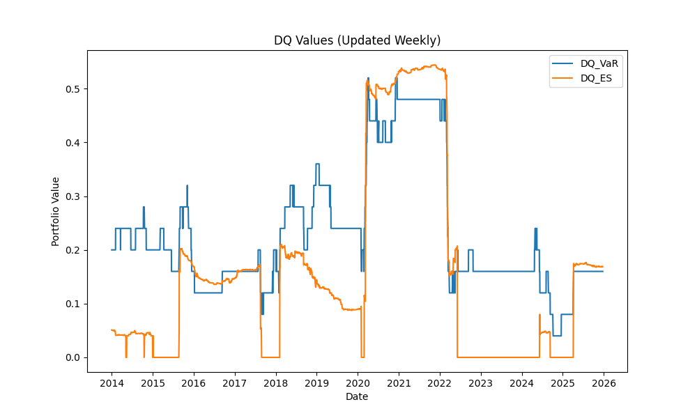
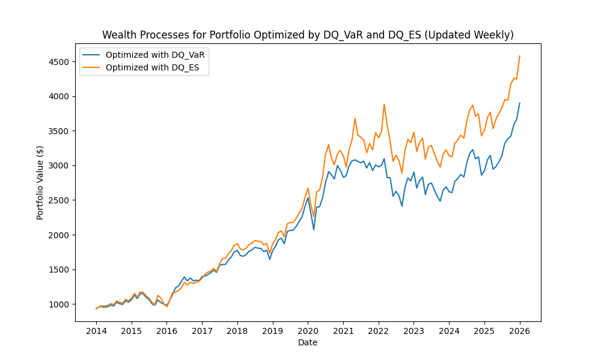

# Diversification Quotient Implementation in Python (Weekly Updated)

This is the implementation of the Diversification Quotient (DQ) in Python that generates weekly updates of the DQ value.




## Usage

To run the code, you need to have Python installed. You can then run the following command:
```bash
python example.py
```

## example.py

We optimize the portfolio weights in each month with a rolling window of 500 days in example.py. That is, at the beginning of each month, starting from 2014/1/2 to 2021/12/32, we use the preceding 500 trading days
to compute the optimal portfolio weights using minimizes DQ based on VaR and ES. The portfolio is rebalanced every month.


## calDQ.py

### DQ_VaR

- The `DQ_VaR` function calculates the value of $\mathrm{DQ}^{\mathrm{VaR}}_\alpha$.
- **Input:**
  - `loss_ratio`: A matrix of loss ratios of n stocks, with each row representing a data record.
  - `alpha`: The significance level for $\mathrm{DQ}^{\mathrm{ES}}_\alpha$.
- **Output:**
  - A real number representing the value of $\mathrm{DQ}^{\mathrm{VaR}}_\alpha$.

### DQ_ES

- The `DQ_ES` function calculates the value of $\mathrm{DQ}^{\mathrm{ES}}_\alpha$.
- **Input:**
  - `loss_ratio`: A matrix of loss ratios of n stocks, with each row representing a data record.
  - `alpha`: The significance level for $\mathrm{DQ}^{\mathrm{ES}}_\alpha$.
- **Output:**
  - A real number representing the value of $\mathrm{DQ}^{\mathrm{ES}}_\alpha$.

---


## optDQ.py

### opt_DQ_VaR

- The `opt_DQ_VaR` function is used to find the optimal portfolio weight that minimizes $\mathrm{DQ}^{\mathrm{VaR}}_\alpha$.
- **Input:**
  - `alpha`: The significance level for $\mathrm{DQ}^{\mathrm{VaR}}_\alpha$.
  - `loss_ratio`: A matrix of loss ratios of n stocks, with each row representing a data record.
  - `tie_breaker`: (Optional) Set to `True` if tie-breaking is needed.
  - `w_0`: (Optional) A vector representing the benchmark portfolio weights.
- **Output:**
  - A tuple `(opt_w, opt_DQ_VaR)` where:
    - `opt_w`: The optimal weight vector that minimizes $\mathrm{DQ}^{\mathrm{VaR}}_\alpha$.
    - `opt_DQ_VaR`: The corresponding minimized value of $\mathrm{DQ}^{\mathrm{VaR}}_\alpha$.

### opt_DQ_ES

- The `opt_DQ_ES` function is used to find the optimal portfolio weight that minimizes $\mathrm{DQ}^{\mathrm{ES}}_\alpha$.
- **Input:**
  - `alpha`: The significance level for DQ.
  - `loss_ratio`: A matrix of loss ratios of n stocks, with each row representing a data record.
  - `tie_breaker`: (Optional) Set to `True` if tie-breaking is needed.
  - `w_0`: (Optional) A vector representing the benchmark portfolio weights.
- **Output:**
  - A tuple `(opt_w, opt_DQ_ES)` where:
    - `opt_w`: The optimal weight vector that minimizes $\mathrm{DQ}^{\mathrm{ES}}_\alpha$.
    - `opt_DQ_ES`: The corresponding minimized value of $\mathrm{DQ}^{\mathrm{ES}}_\alpha$.


If you have specific questions about using this code, implementing it, or interpreting its results, feel free to ask!
